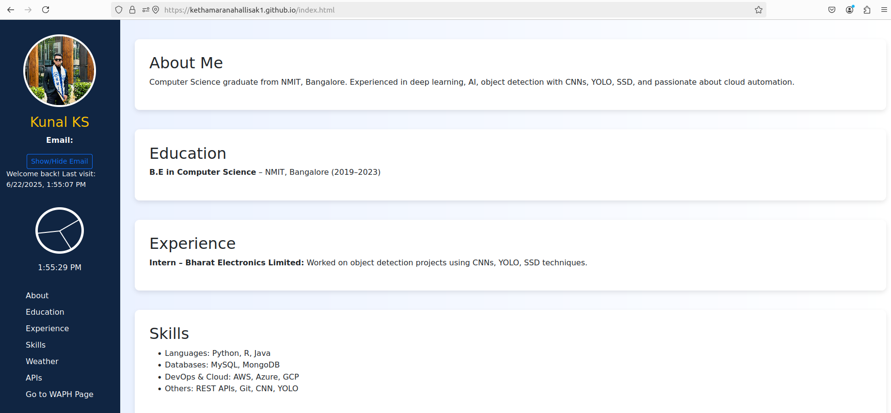
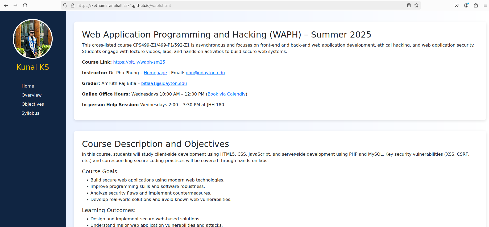

# WAPH-Web Application Programming and Hacking

## Instructor: Dr. Phu Phung

## Student

**Name**: Kunal Kethamaranahalli Sathish

**Email**: [kethamaranahallisak1@udayton.edu](mailto:kethamaranahallisak1@udayton.edu)

**Short-bio**: Kunal has keen interests in ethical hacking and secure software development. 

  

---

## Overview

This project is part of the coursework for the Web Application Programming and Hacking (WAPH) class. The goal was to create a professional profile website hosted on GitHub Pages that could be used as part of a job application. The site includes personal and educational details, technical skills, and live integrations with public APIs.

The portfolio also features a dedicated page introducing the WAPH course and the projects completed throughout it. The design was built using Bootstrap and enhanced with JavaScript for interactive functionality.

- **Deployed Website**: [https://kethamaranahallisak1.github.io](https://kethamaranahallisak1.github.io)
- **GitHub Repository**: [https://github.com/kethamaranahallisak1/kethamaranahallisak1.github.io](https://github.com/kethamaranahallisak1/kethamaranahallisak1.github.io)
---

## Project Requirements and Implementation

### General Requirements

- The website is deployed using GitHub Pages.
- It includes a resume section with name, headshot, contact email, education, experience, and technical skills.
- A link to a separate HTML page (`waph.html`) provides an introduction to the WAPH course and highlights course projects.

### Non-Technical Requirements

- The site uses the Bootstrap framework for layout and styling, ensuring it’s mobile-friendly and responsive.
- The design targets potential employers by maintaining a clean, readable, and professional structure.
- A visitor counter has been embedded using FlagCounter to track page views globally.

### Technical Features

**JavaScript Functionalities:**

- A digital clock shows the current time and updates every second.
- An analog clock is built with dynamic rotation of hands using JavaScript.
- A “Show/Hide Email” button reveals or hides the email address interactively.
- An additional feature displays real-time advice fetched from the Advice Slip API.

**Public API Integrations:**

- **JokeAPI**: Fetches and displays a random joke every minute.
- **XKCD API**: Shows a random XKCD comic with title and image.
- **Weather**: Fetches live weather data based on the user’s geolocation, using OpenStreetMap and Open-Meteo APIs.

A disclaimer has been added to clarify that the content from external APIs is not owned or controlled by the site owner.

**Cookie-based Visit Tracking:**

- First-time visitors are shown a welcome message.
- Returning visitors see a message with the date and time of their last visit, stored via JavaScript cookies.

---

## Screenshots

Below are screenshots of the working features of the site. These will be added before submission:

  
- Home page with sidebar and digital/analog clocks  

  
- Joke, XKCD comic and advice sections showing live API data  

  
- WAPH course page  

---

## Conclusion

This project gave me hands-on experience in building a functional, client-facing website using front-end technologies like HTML, CSS (via Bootstrap), JavaScript, and third-party APIs. I gained a better understanding of integrating real-time data, user tracking through cookies, and deploying a live site on GitHub Pages.

The result is a personal portfolio that reflects both my technical skills and academic work, and it serves as a professional point of contact for future opportunities.